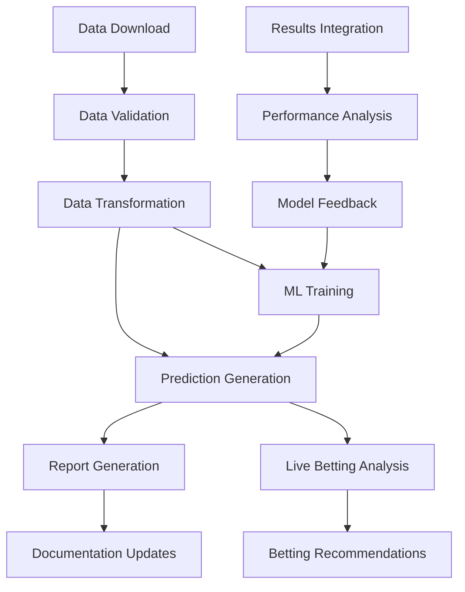

# 🏇 Comprehensive Horse Racing AI Pipeline Architecture
<!-- 🔒 PROTECTED FILE: DO NOT MOVE FROM ROOT - See .keep-in-root for details -->
*Designed for Production-Ready Automated Racing Intelligence*

## 🎯 Pipeline Overview

### Core Objectives
- **Real-time Data Processing**: Continuous data ingestion and validation
- **Advanced ML Training**: Automated model improvement and prediction generation
- **Live Betting Integration**: Real-time odds analysis and betting strategies
- **Post-Race Analytics**: Performance analysis and historical data integration
- **Comprehensive Reporting**: Multi-format reporting with visualizations

## 📊 Pipeline Phases & Stages

### Phase 1: Data Acquisition & Validation
```
┌─────────────────────────────────────────────────────────────┐
│                    DATA ACQUISITION PHASE                   │
├─────────────────────────────────────────────────────────────┤
│ Stage 1.1: Scheduled Data Download                         │
│ ├── Process: Auto-downloader execution                     │
│ ├── Timing: Daily at 19:50 (configurable)                 │
│ ├── Sources: Race cards, Results, Historical data          │
│ └── Output: Raw ZIP files → Extracted CSV/JSON/SQL         │
│                                                             │
│ Stage 1.2: Data Validation & Quality Control               │
│ ├── Process: Comprehensive data validation                 │
│ ├── Checks: Date ranges, Race IDs, File integrity         │
│ ├── Validation: Record counts, Missing data detection      │
│ └── Output: Validated datasets + Quality reports           │
│                                                             │
│ Stage 1.3: Data Transformation & Normalization             │
│ ├── Process: Column mapping, Data cleaning                 │
│ ├── Standardization: Date formats, Race categorization     │
│ ├── Enrichment: Feature engineering, Derived metrics       │
│ └── Output: ML-ready datasets                              │
└─────────────────────────────────────────────────────────────┘
```

### Phase 2: Machine Learning & Prediction
```
┌─────────────────────────────────────────────────────────────┐
│                 MACHINE LEARNING PHASE                      │
├─────────────────────────────────────────────────────────────┤
│ Stage 2.1: Model Training & Optimization                   │
│ ├── Process: Automated ML training pipeline                │
│ ├── Models: XGBoost, Random Forest, Neural Networks        │
│ ├── Validation: Cross-validation, Performance metrics      │
│ └── Output: Trained models + Performance reports           │
│                                                             │
│ Stage 2.2: Prediction Generation                           │
│ ├── Process: Race outcome predictions                      │
│ ├── Metrics: Win probability, Place probability, Rankings  │
│ ├── Confidence: Prediction intervals, Uncertainty scores   │
│ └── Output: Prediction datasets + Confidence metrics       │
│                                                             │
│ Stage 2.3: Model Validation & Performance Analysis         │
│ ├── Process: Backtest against historical data             │
│ ├── Metrics: Accuracy, ROI, Sharpe ratio                   │
│ ├── Comparison: Model performance benchmarking             │
│ └── Output: Performance dashboards + Model comparisons     │
└─────────────────────────────────────────────────────────────┘
```

### Phase 3: Live Betting & Real-time Analysis
```
┌─────────────────────────────────────────────────────────────┐
│                   LIVE BETTING PHASE                        │
├─────────────────────────────────────────────────────────────┤
│ Stage 3.1: Real-time Odds Monitoring                       │
│ ├── Process: Continuous odds scraping                      │
│ ├── Sources: Multiple betting exchanges                    │
│ ├── Frequency: Every 30 seconds during race hours          │
│ └── Output: Live odds data + Market movement tracking      │
│                                                             │
│ Stage 3.2: Dynamic Prediction Updates                      │
│ ├── Process: Real-time model inference                     │
│ ├── Updates: Odds changes, Late scratches, Weather         │
│ ├── Adjustment: Prediction recalculation                   │
│ └── Output: Updated predictions + Change notifications     │
│                                                             │
│ Stage 3.3: Automated Betting Strategy                      │
│ ├── Process: Risk-managed betting decisions                │
│ ├── Strategy: Value betting, Arbitrage detection           │
│ ├── Risk: Bankroll management, Maximum exposure            │
│ └── Output: Betting recommendations + Risk assessments     │
└─────────────────────────────────────────────────────────────┘
```

### Phase 4: Post-Race Analysis & Reporting
```
┌─────────────────────────────────────────────────────────────┐
│                  POST-RACE ANALYSIS PHASE                   │
├─────────────────────────────────────────────────────────────┤
│ Stage 4.1: Results Integration & Validation                │
│ ├── Process: Race results data ingestion                   │
│ ├── Validation: Results consistency checks                 │
│ ├── Integration: Historical database updates               │
│ └── Output: Validated results + Database updates           │
│                                                             │
│ Stage 4.2: Performance Analysis & Model Feedback           │
│ ├── Process: Prediction accuracy assessment                │
│ ├── Analysis: Win/loss analysis, ROI calculation           │
│ ├── Feedback: Model performance metrics                    │
│ └── Output: Performance reports + Model improvement data   │
│                                                             │
│ Stage 4.3: Comprehensive Reporting & Documentation         │
│ ├── Process: Multi-format report generation               │
│ ├── Reports: Daily, Weekly, Monthly summaries              │
│ ├── Visualizations: Charts, Graphs, Performance trends     │
│ └── Output: HTML reports + MkDocs updates + Dashboards     │
└─────────────────────────────────────────────────────────────┘
```

## ⏰ Timing & Scheduling Framework

### Daily Schedule (All times configurable)
```
00:00 - 06:00  │ System Maintenance & Model Training
06:00 - 09:00  │ Pre-race Data Processing
09:00 - 18:00  │ Live Betting & Real-time Monitoring
18:00 - 19:50  │ Data Consolidation & Preparation
19:50 - 20:30  │ Daily Data Download & Processing
20:30 - 23:59  │ Post-race Analysis & Reporting
```

### Process-Level Timing
```
Data Download:        5-10 minutes
Data Validation:      2-5 minutes
ML Training:          10-30 minutes (depending on data size)
Prediction Generation: 1-3 minutes
Report Generation:    5-15 minutes
Total Pipeline:       25-65 minutes per cycle
```

## 📝 Comprehensive Logging Strategy

### Log Levels & Categories
```yaml
CRITICAL: System failures, Data corruption, Security breaches
ERROR:    Pipeline failures, Model training errors, API failures
WARNING:  Data quality issues, Performance degradation, Timeouts
INFO:     Pipeline progress, Model performance, System status
DEBUG:    Detailed execution traces, Variable values, SQL queries
```

### Structured Logging Format
```json
{
  "timestamp": "2025-08-16T19:50:00Z",
  "level": "INFO",
  "phase": "data_acquisition",
  "stage": "download",
  "process": "auto_downloader",
  "message": "Successfully downloaded race data",
  "metadata": {
    "file_count": 15,
    "total_size_mb": 2.5,
    "race_count": 61,
    "execution_time_seconds": 45
  },
  "correlation_id": "pipeline_20250816_1950"
}
```

### Log Storage & Rotation
```
├── logs/
│   ├── daily/
│   │   ├── pipeline_YYYYMMDD.log
│   │   ├── ml_training_YYYYMMDD.log
│   │   ├── betting_YYYYMMDD.log
│   │   └── errors_YYYYMMDD.log
│   ├── weekly/
│   │   └── summary_YYYYWW.log
│   └── alerts/
│       └── critical_alerts.log
```

## 🚨 Advanced Error Handling Framework

### Error Classification & Response
```yaml
Data Errors:
  - Missing files: Retry download, Use cached data, Alert admin
  - Corrupt data: Validate checksums, Request re-download
  - Format errors: Auto-correction, Manual review queue

System Errors:
  - Database failures: Auto-failover, Connection pooling
  - Memory issues: Garbage collection, Process restart
  - Network timeouts: Exponential backoff, Circuit breaker

Model Errors:
  - Training failures: Fallback to previous model, Alert ML team
  - Prediction errors: Use ensemble backup, Quality checks
  - Performance degradation: Auto-retrain, A/B testing

External API Errors:
  - Rate limiting: Backoff strategy, Multiple providers
  - Authentication: Token refresh, Credential rotation
  - Service unavailable: Failover providers, Cached responses
```

### Retry & Recovery Strategies
```python
class RetryStrategy:
    exponential_backoff = [1, 2, 4, 8, 16, 32]  # seconds
    max_retries = 6
    circuit_breaker_threshold = 5
    health_check_interval = 60
    
class RecoveryActions:
    data_fallback = "use_previous_day_data"
    model_fallback = "use_last_trained_model"
    service_fallback = "switch_to_backup_provider"
    notification_channels = ["email", "slack", "ntfy"]
```

## 📊 Comprehensive Reporting System

### Report Types & Frequencies
```yaml
Real-time Dashboards:
  - Live betting opportunities
  - Model performance metrics
  - System health monitoring
  - Frequency: Every 30 seconds during race hours

Daily Reports:
  - Pipeline execution summary
  - Data quality assessment
  - Prediction accuracy
  - Betting performance
  - System performance metrics

Weekly Reports:
  - Model performance trends
  - ROI analysis
  - Data source reliability
  - System utilization

Monthly Reports:
  - Strategic performance review
  - Model evolution analysis
  - Cost-benefit analysis
  - Recommendations for improvement
```

### Report Formats & Distribution
```yaml
Formats:
  - HTML: Interactive dashboards with charts
  - PDF: Executive summaries
  - JSON: API endpoints for external systems
  - CSV: Raw data exports
  - Excel: Detailed analysis workbooks

Distribution:
  - Web dashboards: Real-time access
  - Email: Scheduled delivery
  - Slack: Instant notifications
  - API: External system integration
  - File storage: Historical archive
```

## 🔄 Pipeline Orchestration & Dependencies

### Dependency Graph


### Parallel Processing Opportunities
```yaml
Parallel Stages:
  - Data validation + Previous results analysis
  - Multiple model training (different algorithms)
  - Report generation + Documentation updates
  - Live odds monitoring + Prediction updates

Sequential Requirements:
  - Download → Validation → Training
  - Training → Prediction → Betting
  - Results → Analysis → Feedback
```

## 🎛️ Configuration Management

### Environment-Specific Configs
```yaml
Development:
  schedule: "*/5 * * * *"  # Every 5 minutes for testing
  data_sources: "mock_data"
  ml_training: "fast_mode"
  
Staging:
  schedule: "0 20 * * *"   # Once daily at 8 PM
  data_sources: "test_apis"
  ml_training: "full_mode"
  
Production:
  schedule: "50 19 * * *"  # Daily at 7:50 PM
  data_sources: "live_apis"
  ml_training: "optimized_mode"
```

### Feature Flags
```yaml
features:
  live_betting_enabled: true
  automated_betting: false  # Manual approval required
  model_auto_retrain: true
  real_time_notifications: true
  advanced_analytics: true
```

## 🔧 Monitoring & Alerting

### Key Performance Indicators (KPIs)
```yaml
System KPIs:
  - Pipeline completion rate: >99%
  - Average execution time: <60 minutes
  - Data quality score: >95%
  - Model accuracy: >75%
  - System uptime: >99.9%

Business KPIs:
  - Prediction accuracy: Track weekly trends
  - ROI: Monthly performance vs benchmark
  - Risk metrics: Drawdown, Sharpe ratio
  - Cost efficiency: Cost per prediction
```

### Alert Thresholds
```yaml
Critical Alerts:
  - Pipeline failure: Immediate
  - Data corruption: Immediate
  - Model accuracy drop >10%: 1 hour
  - System downtime: Immediate

Warning Alerts:
  - Execution time >90 minutes: 30 minutes
  - Data quality <90%: 2 hours
  - Prediction confidence low: Daily summary
  - Resource utilization >80%: 1 hour
```

This comprehensive architecture provides a robust foundation for scaling from our current successful pipeline to a full production betting and analysis system. Each phase is designed to be independently scalable and maintainable.
