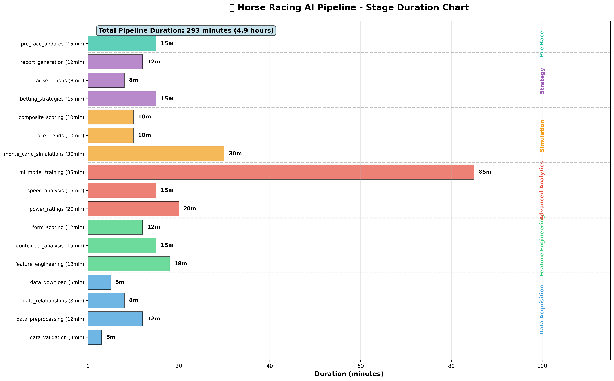
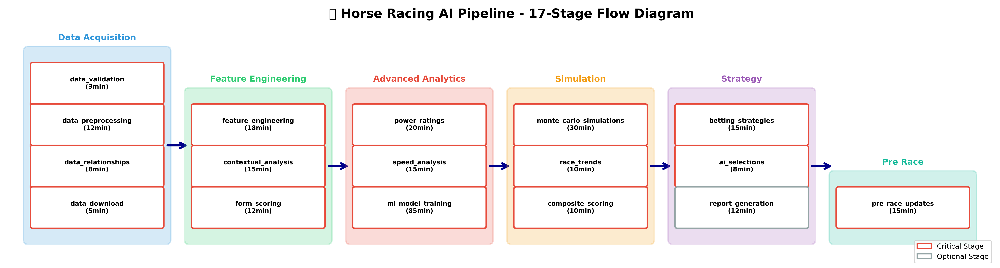

# 📊 Pipeline Overview

## Current 17-Stage Pipeline Architecture

The Horse Racing AI system utilizes a comprehensive 17-stage pipeline across 6 phases, processing data from acquisition to final predictions.

### 🎯 Pipeline Summary

- **Total Duration**: 293 minutes (4.9 hours)
- **Total Stages**: 17 (16 critical, 1 optional)
- **Total Phases**: 6
- **Processing Model**: Batch processing with planned real-time capabilities

### 📋 Phase Breakdown

| Phase                  | Duration | Stages | Critical | Optional |
| ---------------------- | -------- | ------ | -------- | -------- |
| 📋 Data Acquisition    | 28 min   | 4      | 4        | 0        |
| 📊 Feature Engineering | 45 min   | 3      | 3        | 0        |
| 🧠 Advanced Analytics  | 120 min  | 3      | 3        | 0        |
| 🎯 Simulation          | 50 min   | 3      | 3        | 0        |
| 💰 Strategy            | 35 min   | 3      | 2        | 1        |
| 🏁 Pre-Race            | 15 min   | 1      | 1        | 0        |

### 🔄 Complete Stage List

#### 📋 DATA ACQUISITION PHASE (28 minutes)

1. **DATA_DOWNLOAD** (5min) - Critical
2. **DATA_VALIDATION** (3min) - Critical
3. **DATA_PREPROCESSING** (12min) - Critical
4. **DATA_RELATIONSHIPS** (8min) - Critical

#### 📊 FEATURE ENGINEERING PHASE (45 minutes)

5. **FEATURE_ENGINEERING** (18min) - Critical
6. **CONTEXTUAL_ANALYSIS** (15min) - Critical
7. **FORM_SCORING** (12min) - Critical

#### 🧠 ADVANCED ANALYTICS PHASE (120 minutes)

8. **POWER_RATINGS** (20min) - Critical
9. **SPEED_ANALYSIS** (15min) - Critical
10. **ML_MODEL_TRAINING** (85min) - Critical

#### 🎯 SIMULATION PHASE (50 minutes)

11. **MONTE_CARLO_SIMULATIONS** (30min) - Critical
12. **RACE_TRENDS** (10min) - Critical
13. **COMPOSITE_SCORING** (10min) - Critical

#### 💰 STRATEGY PHASE (35 minutes)

14. **BETTING_STRATEGIES** (15min) - Critical
15. **AI_SELECTIONS** (8min) - Critical
16. **REPORT_GENERATION** (12min) - Optional

#### 🏁 PRE-RACE PHASE (15 minutes)

17. **PRE_RACE_UPDATES** (15min) - Critical

## 🚀 Expansion Plans

The pipeline is designed for expansion with the following enhancement areas:

### High Priority Expansions

- **Multi-source Data Aggregation** (DATA_DOWNLOAD)
- **AI-powered Anomaly Detection** (DATA_VALIDATION)
- **Automated Feature Discovery** (FEATURE_ENGINEERING)
- **Weather Impact Modeling** (CONTEXTUAL_ANALYSIS)

### Live Racing Integration

- **Real-time Data Streaming**
- **Dynamic Model Updates**
- **Post-race Learning**
- **Continuous Improvement**

For detailed expansion plans, see:

- [Pipeline Expansion Roadmap](PIPELINE_EXPANSION_ROADMAP.md)
- [Live Racing Integration Plan](LIVE_RACING_INTEGRATION_PLAN.md)

## 📈 Performance Metrics

### Current Performance

- **Prediction Accuracy**: ~65% (estimated)
- **Processing Throughput**: ~100 races/day
- **System Availability**: Manual operation
- **Model Update Frequency**: Manual

### Target Performance (Post-Expansion)

- **Prediction Accuracy**: 75%+
- **Processing Throughput**: 1000+ races/day
- **System Availability**: 99.9% automated
- **Model Update Frequency**: Real-time continuous learning

## 🔧 Technical Architecture

The pipeline utilizes:

- **Database**: PostgreSQL for primary data storage
- **Caching**: Redis for high-speed data access
- **Processing**: Python-based ML pipeline
- **Orchestration**: Docker Compose with health checks
- **Monitoring**: NTFY notifications and health checks
- **Documentation**: MkDocs with visual charts

## 📊 Visual Charts

For detailed visual representations of the pipeline:

- [Pipeline Visual Charts](pipeline-charts.md)
- 
- 
