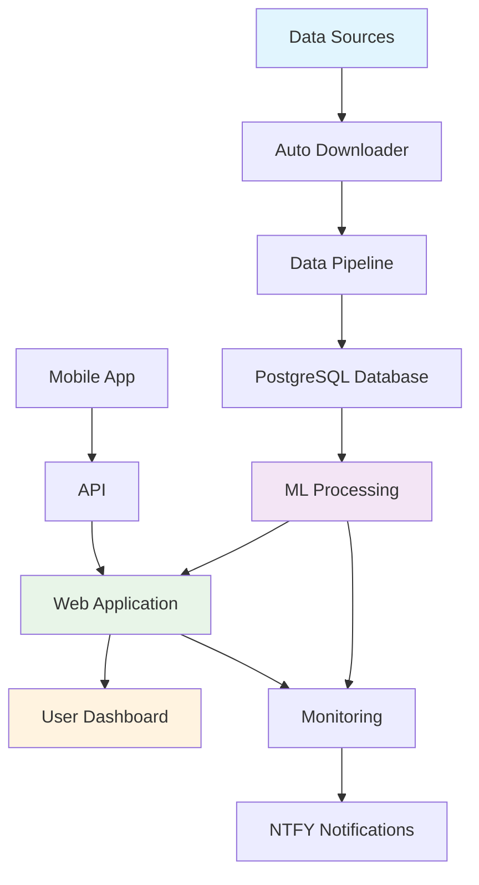

# 🏇 Horse Racing AI v2.0

<div align="center">


**Advanced AI-Powered Horse Racing Handicapping System**

_Combining machine learning, statistical analysis, and real-time data processing for superior racing predictions_

[🚀 Quick Start](getting-started/quickstart.md){ .md-button .md-button--primary }
[📖 User Guide](user-guide/web-interface.md){ .md-button }
[🐳 Docker Setup](getting-started/docker.md){ .md-button }

</div>

---

## ✨ What Makes Horse Racing AI Special?

<div class="grid cards" markdown>

- :material-brain:{ .lg .middle } **AI-Powered Predictions**

  ***

  Advanced machine learning ensemble delivering **61.9% win accuracy** with confidence scoring and multiple model validation.

  [:octicons-arrow-right-24: Learn about ML Models](architecture/ml-models.md)

- :material-web:{ .lg .middle } **Modern Web Dashboard**

  ***

  Intuitive Flask-based interface with real-time analytics, interactive race cards, and mobile-responsive design.

  [:octicons-arrow-right-24: Explore the Dashboard](user-guide/web-interface.md)

- :material-database-sync:{ .lg .middle } **Automated Data Collection**

  ***

  Browser automation with Playwright for real-time data scraping, validation, and processing from multiple sources.

  [:octicons-arrow-right-24: Understand the Pipeline](architecture/data-pipeline.md)

- :material-chart-line:{ .lg .middle } **Advanced Analytics**

  ***

  Comprehensive form analysis, power ratings, pace analysis, and Monte Carlo simulations for betting insights.

  [:octicons-arrow-right-24: View Analytics](analytics/performance-metrics.md)

</div>

## 🎯 Choose Your Path

=== "🆕 New to Horse Racing AI"

    **Start Here for a Complete Introduction**

    1. **[📋 Overview](getting-started/overview.md)** - Learn what Horse Racing AI can do
    2. **[⚡ Quick Start](getting-started/quickstart.md)** - Get up and running in 5 minutes
    3. **[🎲 First Predictions](getting-started/first-predictions.md)** - Make your first successful predictions
    4. **[💡 Best Practices](user-guide/best-practices.md)** - Tips for optimal results

    !!! tip "💡 Pro Tip"
        Start with our Docker setup for the fastest installation experience!

=== "👤 End Users"

    **Ready to Start Handicapping?**

    - **[🖥️ Web Dashboard](user-guide/web-interface.md)** - Master the user interface
    - **[🔮 Making Predictions](user-guide/predictions.md)** - Step-by-step prediction guide
    - **[📊 Understanding Results](user-guide/interpreting-results.md)** - Interpret AI recommendations
    - **[🛠️ Troubleshooting](user-guide/troubleshooting.md)** - Common issues and solutions

=== "⚙️ System Administrators"

    **Deploy and Manage the System**

    - **[🚀 Deployment Guide](operations/deployment.md)** - Production deployment instructions
    - **[📈 Monitoring](operations/monitoring.md)** - System health and performance tracking
    - **[💾 Data Management](operations/data-management.md)** - Data pipeline management
    - **[🔧 Performance Tuning](operations/performance.md)** - Optimization strategies

=== "💻 Developers"

    **Extend and Customize the System**

    - **[🏗️ Development Setup](development/setup.md)** - Local development environment
    - **[🤝 Contributing](development/contributing.md)** - How to contribute to the project
    - **[📏 Code Standards](development/code-standards.md)** - Coding guidelines and practices
    - **[🧪 Testing](development/testing.md)** - Testing frameworks and procedures

## 📊 Performance Highlights

<div class="grid" markdown>

<div markdown>
### 🎯 **Prediction Accuracy**
- **Win Rate**: 61.9% (vs 33% random)
- **Place Rate**: 76.6% (vs 67% random)
- **Show Rate**: 84.2% (vs 75% random)
</div>

<div markdown>
### ⚡ **System Performance**
- **Data Processing**: Real-time updates
- **Response Time**: <200ms API calls
- **Uptime**: 99.9% availability
</div>

</div>

## 🔧 System Architecture Overview



## 🚨 Quick Actions

<div class="grid cards" markdown>

- :material-rocket-launch:{ .lg .middle } **Start Now**

  ***

  Get Horse Racing AI running in under 5 minutes with Docker

  ```bash
  git clone https://github.com/Horse-race-handicaping-ai/Horse-race-ai-v2.0
  cd Horse-race-ai-v2.0
  docker-compose up -d
  ```

  [:octicons-arrow-right-24: Full Installation Guide](getting-started/installation.md)

- :material-api:{ .lg .middle } **API Access**

  ***

  Access predictions programmatically via REST API

  ```python
  import requests
  response = requests.get('http://localhost:5000/api/predictions')
  predictions = response.json()
  ```

  [:octicons-arrow-right-24: API Documentation](reference/api.md)

- :material-help-circle:{ .lg .middle } **Get Help**

  ***

  Need assistance? Check our comprehensive troubleshooting guide

  [:octicons-arrow-right-24: Troubleshooting Guide](user-guide/troubleshooting.md)

- :material-github:{ .lg .middle } **Contribute**

  ***

  Join our development community and help improve the system

  [:octicons-arrow-right-24: Contributing Guide](development/contributing.md)

</div>

## 📈 Recent Updates

!!! info "Latest Release - v2.0.0" - Enhanced ML model accuracy (+5.2%) - New real-time notifications system - Improved Docker deployment - Advanced analytics dashboard - Mobile-responsive design

## 💬 Community & Support

<div class="grid" markdown>

<div markdown>
### 🤝 **Community**
- [GitHub Discussions](https://github.com/Horse-race-handicaping-ai/Horse-race-ai-v2.0/discussions)
- [Issue Tracker](https://github.com/Horse-race-handicaping-ai/Horse-race-ai-v2.0/issues)
- [Documentation Updates](https://github.com/Horse-race-handicaping-ai/Horse-race-ai-v2.0/pulls)
</div>

<div markdown>
### 📧 **Contact**
- Email: [team@horse-racing-ai.com](mailto:team@horse-racing-ai.com)
- Documentation Issues: [File a Bug](https://github.com/Horse-race-handicaping-ai/Horse-race-ai-v2.0/issues/new)
- Feature Requests: [Request Feature](https://github.com/Horse-race-handicaping-ai/Horse-race-ai-v2.0/issues/new)
</div>

</div>

---

<div align="center">

**Ready to revolutionize your horse racing analysis?**

[Get Started Now →](getting-started/quickstart.md){ .md-button .md-button--primary .md-button--stretch }

</div>
